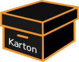
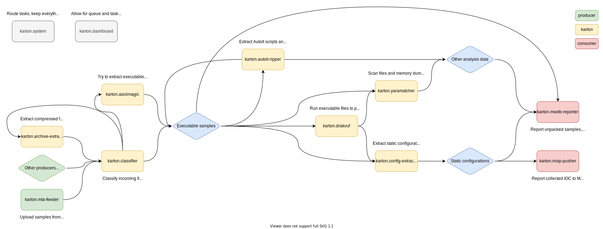

# Karton 

Distributed malware processing framework based on Python, Redis and S3.

## The idea

Karton is a robust framework for creating **flexible** and **lightweight** malware analysis backends.
It can be used to connect malware* analysis systems into a robust pipeline with very little effort.

We've been in the automation business for a long time. We're dealing with more and more threats, and we have to automate everything to keep up with incidents. Because of this, we often end up with many scripts stuck together with ~~duck~~ duct tape and WD-40. These scripts are written by analysts in the heat of the moment, fragile and ugly - but they work, and produce intel that must be stored, processed further, sent to other systems or shared with other organisations.

We needed a way to take our PoC scripts and easily insert them into our analysis pipeline. We also wanted to monitor their execution, centralise logging, improve robustness, reduce development inertia... For this exact purpose, we created **Karton**.


*\* while Karton was designed with malware analysis in mind, it works nicely in every microservice-oriented project.*


## Installation

Installation is as easy as a single `pip install` command:

```
pip3 install karton-core
```

In order to setup the whole backend environment you will also need S3-compatible storage and Redis, see the [docs](https://karton-core.readthedocs.io/en/latest/getting_started.html#installation) for details.

## Example usage
To use karton you have to provide class that inherits from Karton.


```python
from karton.core import Karton, Task, Resource

class GenericUnpacker(Karton):
    """
    Performs sample unpacking
    """
    identity = "karton.generic-unpacker"
    filters = [
        {
            "type": "sample",
            "kind": "runnable",
            "platform": "win32"
        }
    ]

    def process(self, task: Task) -> None:
        # Get sample object
        packed_sample = task.get_resource('sample')
        # Log with self.log
        self.log.info(f"Hi {packed_sample.name}, let me analyze you!")
        ...
        # Send our results for further processing or reporting
        task = Task(
            {
               "type": "sample",
               "kind": "raw"
            }, payload = {
               "parent": packed_sample,
               "sample": Resource(filename, unpacked)
            })
        self.send_task(task)

if __name__ == "__main__":
    # Here comes the main loop
    GenericUnpacker().loop()
```

## Karton systems

Some Karton systems are universal and useful to everyone. We decided to share them with the community.

#### [karton](https://github.com/CERT-Polska/karton)
This repository. It contains the `karton.system` service - main service, responsible for dispatching tasks within the system. It also contains the `karton.core` module, that is used as a library by other systems.

#### [karton-dashboard](https://github.com/CERT-Polska/karton-dashboard)
A small Flask dashboard for task and queue management and monitoring.

#### [karton-classifier](https://github.com/CERT-Polska/karton-classifier)
The "router". It recognises samples/files and produces various task types depending on the file format. Thanks to this, other systems may only listen for tasks with a specific format (for example, only `zip` archives).

#### [karton-archive-extractor](https://github.com/CERT-Polska/karton-archive-extractor)
Generic archive unpacker. Archives uploaded into the system will be extracted, and every file will be processed individually.

#### [karton-config-extractor](https://github.com/CERT-Polska/karton-config-extractor)
Malware extractor. It uses Yara rules and Python modules to extract static configuration from malware samples and analyses. It's a fishing rod, not a fish - we don't share the modules themselves. But it's easy to write your own!

#### [karton-mwdb-reporter](https://github.com/CERT-Polska/karton-mwdb-reporter)
A very important part of the pipeline. Reporter submits all files, tags, comments and other intel produced during the analysis to [MWDB](https://github.com/CERT-Polska/mwdb-core). If you don't use MWDB yet or just prefer other backends, it's easy to write your own reporter.

#### [karton-yaramatcher](https://github.com/CERT-Polska/karton-yaramatcher)
Automatically runs Yara rules on all files in the pipeline, and tags samples appropriately. Rules not included ;).

#### [karton-asciimagic](https://github.com/CERT-Polska/karton-asciimagic)
Karton system that decodes files encoded with common methods, like `hex`, `base64`, etc. (You wouldn't believe how common it is).

#### [karton-autoit-ripper](https://github.com/CERT-Polska/karton-autoit-ripper)
A small wrapper around [AutoIt-Ripper](https://github.com/nazywam/AutoIt-Ripper) that extracts embedded AutoIt scripts and resources from compiled AutoIt executables.

#### [DRAKVUF Sandbox](https://github.com/CERT-Polska/drakvuf-sandbox)
Automated black-box malware analysis system with DRAKVUF engine under the hood, which does not require an agent on guest OS.

---

This is how these systems can be used to form a basic malware analysis pipeline:
[](img/karton-systems.svg?raw=true)


## Community projects that incorporate the Karton framework

#### [c3rb3ru5d3d53c/karton-unpacker](https://github.com/c3rb3ru5d3d53c/karton-unpacker)
A modular Karton Framework service that unpacks common packers like UPX and others using the Qiling Framework.

#### [c3rb3ru5d3d53c/mwcfg](https://github.com/c3rb3ru5d3d53c/mwcfg) / [c3rb3ru5d3d53c/mwcfg-modules](https://github.com/c3rb3ru5d3d53c/mwcfg-modules)
A Feature Rich Modular Malware Configuration Extraction Utility for MalDuck

#### [raw-data/karton-die-classifier](https://github.com/raw-data/karton-die-classifier)
Detect-It-Easy classifier for the Karton framework

#### [raw-data/karton-retdec-unpacker](https://github.com/raw-data/karton-retdec-unpacker)
RetDec unpacker module for the Karton framework

#### [W3ndige/aurora](https://github.com/W3ndige/aurora) / [W3ndige/karton-similarity](https://github.com/W3ndige/karton-similarity)
Malware similarity platform with modularity in mind.


