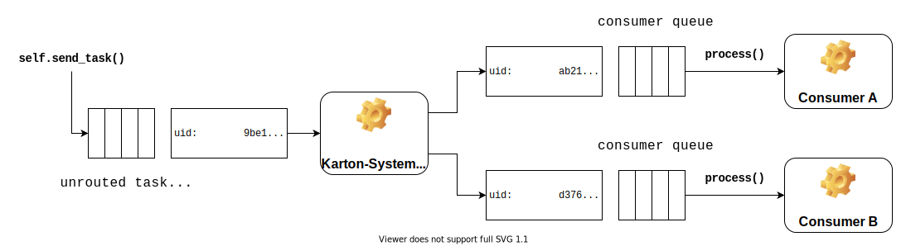
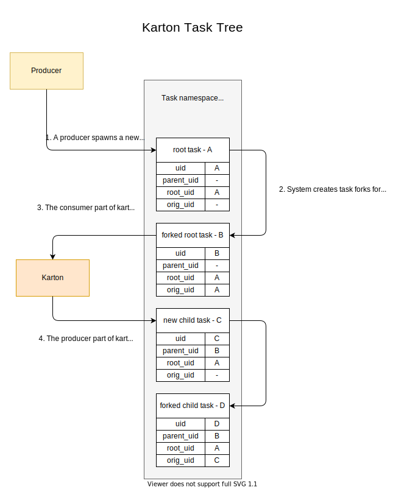

Advanced concepts
=================

Routed and unrouted tasks (task forking)
----------------------------------------

During its lifetime, the task will transfer between various states and its reference will be passed through several queues, a simple way to understand it is to see how the tasks state changes in various moments:


Each new task is registered in the system by a call to :py:meth:`karton.Producer.send_task` and starts its life in the **unrouted task queue** with a ``TaskState.Declared`` state.

All actual task data is stored in the ``Karton.task`` namespace and all other (routed and unrouted) queues will be always only holding a reference to a record from this place.

The main broker - ``karton.System`` constantly looks over the unrouted (``karton.tasks``) queue and keeps the tasks running as well as clears up leftover unneeded data.

Because task headers can be accepted by more than one consumer the task has to be forked before it goes to the appropriate **consumer (routed) queues**. Based on **unrouted task**, ``Karton.System`` generates as many **routed tasks** as there are matching queues. These tasks are separate, independent instances, so they have different **uid** than original unrouted task.

.. note::
    
    While **uid** of routed and unrouted tasks are different, **parent_uid** stays the same. **parent_uid** always identifies the routed task.

    Reference to the unrouted task is called **orig_uid**.

Each registered consumer monitors its (routed) queue and performs analysis on all tasks that appear there. As soon as the consumer starts working on a given task, it sends a signal to the broker to mark the tasks state as ``TaskState.Started``.

If everything goes smoothly, the consumer finishes the tasks and sends a similiar signal, this time marking the task as ``TaskState.Finished``. If there is a problem and an exception is thrown within the ``self.process`` function, ``TaskState.Crashed`` is used instead.

As a part of its housekeeping, ``Karton.System`` removes all ``TaskState.Finished`` tasks immediately and ``TaskState.Crashed`` tasks after a certain grace period to allow for inspection and optional retry.


Task tree (analysis) and task life cycle
----------------------------------------

Every analysis starts from **initial task** spawned by :class:`karton.Producer`. **Initial task** is consumed by consumers, which then produce next tasks for further processing. These various tasks originating from initial task can be grouped together into a **task tree**, representing the analysis.



Each task is identified by a tuple of three identifiers:

- **uid** - unique task identifier
- **parent_uid** - identifier of task that spawned current task as a result of processing
- **root_uid** - task tree identifier (analysis identifier, derived from uid of initial **unrouted** task)
- **orig_uid** - identifier of the original task that was forked to create this task (unrouted task or retried crashed task)

In order to better understand how those identifiers are inherited and passed between tasks take a look at the following example:




Handling logging
----------------
By default, all systems inheriting from :py:meth:`karton.core.KartonBase` will have a custom :py:meth:`logging.Logger` instance exposed as :py:meth:`log`. It publishes all logged messages to a special PUBSUB key on the central Redis database.

In order to store the logs into a persistent storage like Splunk or Rsyslog you have to implement a service that will consume the log entries and send them to the final database, for an example of such service see :ref:`example-consuming-logs`.

The logging level can be configured using the standard karton config and setting ``level`` in the ``logging`` section to appropriate level like :code:`"DEBUG"`, :code:`"INFO"` or :code:`"ERROR"`.


Consumer queue persistence
--------------------------

Consumer queue is created on the first registration of consumer and it gets new tasks even if all consumer instances are offline. It guarantees that analysis will complete even after short downtime of part of subsystems. Unfortunately, it also blocks completion of the analysis when we connect a Kartonik which is currently developed or temporary.

We can turn off queue persistence using the :code:`persistent = False` attribute in the Karton subsystem class.

.. code-block:: python

    class TemporaryConsumer(Karton):
        identity = "karton.temporary-consumer"
        filters = ...
        persistent = False

        def process(self, task: Task) -> None:
            ...

This is also the (hacky) way to remove persistent queue from the system. Just launch empty consumer with identity you want to remove, wait until all tasks will be consumed and shut down the consumer.

.. code-block:: python

    from karton.core import Karton

    class DeleteThisConsumer(Karton):
        identity = "karton.identity-to-be-removed"
        filters = {}
        persistent = False

        def process(self, task: Task) -> None:
            pass

    DeleteThisConsumer().loop()

Prioritized tasks
-----------------

Karton allows to set priority for task tree: :attr:`TaskPriority.HIGH`, :attr:`TaskPriority.NORMAL` (default) or :attr:`TaskPriority.LOW`. Priority is determined by producer spawning an initial task.

.. code-block:: python

    producer = Producer()
    task = Task(
        headers=...,
        priority=TaskPriority.HIGH
    )
    producer.send_task(task)

All tasks within the same task tree have the same priority, which is derived from the priority of initial task. If consumer will try to set different priority for spawned tasks, new priority settings will be simply ignored.

Extending configuration
-----------------------

During processing we may need to fetch data from external service or use libraries that need to be pre-configured. The simplest approach is to use separate configuration file, but this is a bit messy.

Karton configuration is represented by special object :class:`karton.Config`, which can be explicitly provided as an argument to the Karton constructor. `Config` is based on :class:`configparser.ConfigParser`, so we can extend it with additional sections for custom configuration.

For example, if we need to communicate with Malwarecage, we can make Malwarecage binding available via :code:`self.config.mwdb`

.. code-block:: python

    import mwdblib

    class MWDBConfig(Config):
        def __init__(self, path=None) -> None:
            super().__init__(path)
            self.mwdb_config = dict(self.config.items("mwdb"))

        def mwdb(self) -> mwdblib.MWDB:
            api_key=self.mwdb_config.get("api_key")
            api_url=self.mwdb_config.get("api_url", mwdblib.api.API_URL)

            mwdb = mwdblib.MWDB(api_key=api_key, api_url=api_url)
            if not api_key:
                mwdb.login(
                    self.mwdb_config["username"],
                    self.mwdb_config["password"])
            return mwdb

    class GenericUnpacker(Karton):
        ...

        def process(self, task: Task) -> None:
            file_hash = task.get_payload("file_hash")
            sample = self.config.mwdb().query_file(file_hash)

    if __name__ == "__main__":
        GenericUnpacker(MWDBConfig()).loop()

and provide additional section in `karton.ini` file:

.. code-block::

   [minio]
   secret_key = <redacted>
   access_key = <redacted>
   address = 127.0.0.1:9000
   bucket = karton
   secure = 0

   [redis]
   host = 127.0.0.1
   port = 6379

   [mwdb]
   api_url = http://127.0.0.1:5000/api
   api_key = <redacted>

Karton-wide and instance-wide configuration
```````````````````````````````````````````

By default the configuration is searched in the following locations (by searching order):

- :code:`/etc/karton/karton.ini`
- :code:`~/.config/karton/karton.ini`
- :code:`./karton.ini`
- environment variables

Each next level overrides and merges with the values loaded from the previous path. It means that we can provide karton-wide configuration and specialized instance-wide extended configuration specific for subsystem.

Contents of :code:`/etc/karton/karton.ini`:

.. code-block::

   [minio]
   secret_key = <redacted>
   access_key = <redacted>
   address = 127.0.0.1:9000
   bucket = karton
   secure = 0

   [redis]
   host = 127.0.0.1
   port = 6379

and specialized configuration in the working directory :code:`./karton.ini`

.. code-block::

   [mwdb]
   api_url = http://127.0.0.1:5000/api
   api_key = <redacted>

Passing tasks to the external queue
-----------------------------------

Karton can be used to delegate tasks to separate queues e.g. external sandbox. External sandboxes usually have their own concurrency and queueing mechanisms, so Karton subsystem needs to:

- dispatch task to the external service
- wait until service ends processing
- fetch results and spawn result tasks keeping the `root_uid` and `parent_uid`

We tried to solve this using asynchronous tasks but it turned out to be very hard to be implemented correctly and didn't really fit in to with the Karton model.

Busy waiting
````````````
The simplest way to do that is to perform all of these actions synchronously, inside the :meth:`process` method.

.. code-block:: python
    
    def process(self, task: Task) -> None:
        sample = task.get_resource("sample")
        
        # Dispatch task, getting the analysis_id
        with sample.download_temporary_file() as f:
            analysis_id = sandbox.push_file(f)
        
        # Wait until analysis finish
        while sandbox.is_finished(analysis_id):
            # Check every 5 seconds
            time.sleep(5)

        # If analysis has been finished: get the results and process them
        analysis = sandbox.get_results(analysis_id)
        self.process_results(analysis)
