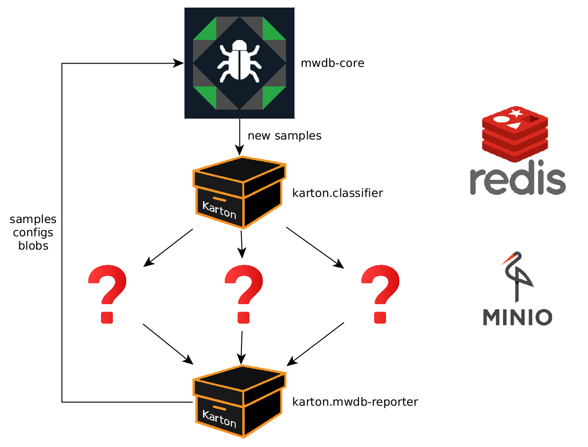

# How to run a karton service?

This is a short tutorial for people who stumbled upon a Karton service and want to know how to use it.

### The karton way

Karton is a modular framework dedicated for malware analysts. Karton services
are not usually run independently. Think of them as "plugins", elements of a
bigger pipeline.

A simple Karton deployment (with mwdb as an interface), looks like this:

Question marks are placeholders for your other Karton services.

You can quickly configure this pipeline with a docker-compose from [karton-playground](https://github.com/CERT-Polska/karton-playground).

### The blue pill

Sadly, it's not possible to run a Karton service without Redis, Minio and
`karton-system` manager. We encourage you to try Karton, but we understand
that not everyone wants to do all of this just to test a random piece of code.

But don't despair - most of the services we published are just a thin wrappers
over another libraries. For example,
[karton-autoit-ripper](https://github.com/CERT-Polska/karton-autoit-ripper) is
"just" a wrapper over
[`nazywam/AutoIt-Ripper`](https://github.com/nazywam/AutoIt-Ripper) project.
More often than not, you can use the library without Karton.
